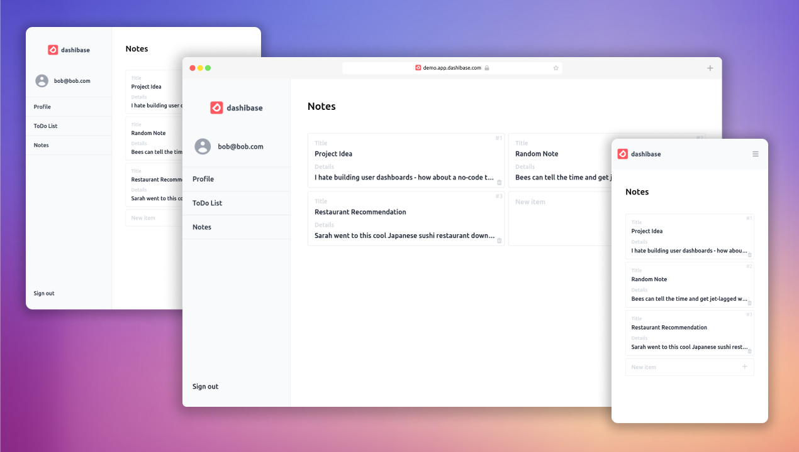

## Hello, World!

After pivoting around 5 different ideas, we concluded that we really hate building dashboards.

[Dashibase](https://dashibase.com) is a tribute to our hatred for all the boilerplate code that we had to write. It's still far from done but already contains some of the most annoying things you'll need to build for your next dashboard or app:

- Sign-in and sign-up pages
- Form validation
- Cards or table views
- CRUD interfaces
- Responsive everything

All of that with batteries included, plugged right into [Supabase](https://supabase.com), our favorite backend.

And of course, we had to make it open-source. [Give us a star!](https://github.com/dashibase/dashibase)
