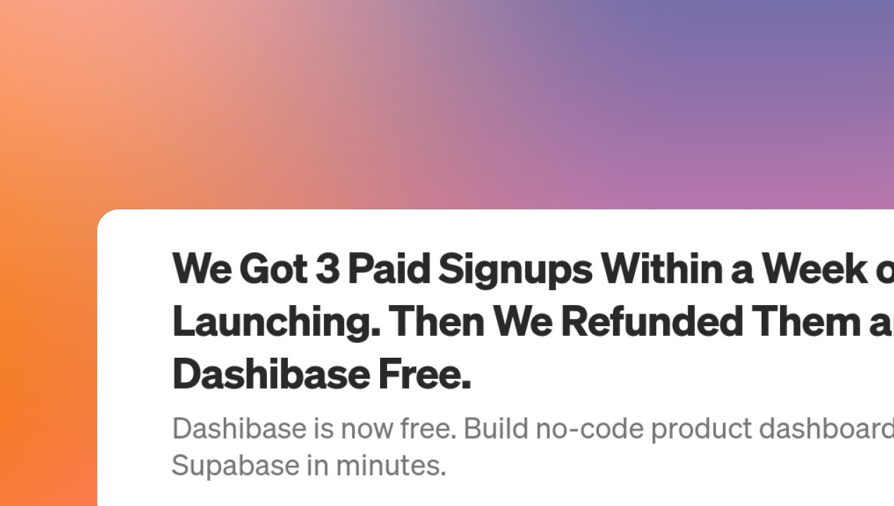

## Dashibase is free!

We recently refunded our paying users and made the hosted version of Dashibase free. Read more [here](https://medium.com/dashibase/we-got-3-paid-signups-within-a-week-of-launching-then-we-refunded-them-and-made-dashibase-free-8a9e7c4b744a).

## An important note

Because most of you are creating dashboards for your own end-users, updates to Dashibase will affect them as well. While we are keen to move fast, we also want Dashibase to be a stable platform to build on. The last thing we want is for a buggy update to break your deployed dashboards.
Our current tentative plan (not rolled out yet) is to implement the following:

- A beta build for those of you adventurous ones to test new Dashibase features before rolling these out in our main app (thanks @Bryan Klein for the suggestion!)
- A staging area for you to test any changes before deploying to your live dashboard

We are still figuring out how this will work and appreciate any suggestions.

## Fixes and improvements

- Migrated Vue code from Options API to Composition API and improve code reusability
- Add read-only option for entire page or individual attributes
  - Defaults to false
- Add pagination for cards and list views
- Support the following types of attributes with corresponding form elements
  - Text (default)
  - Long text - A larger text input (textarea)
  - Date - A date picker
  - True/false - dropdown with true or false options
    - This will eventually change to a toggle
  - Multiple choice - dropdown with custom options
  - Available attribute types are defined in the [config.ts](https://github.com/Dashibase/dashibase/blob/41c54c5a955779c321a8c1a207e9ea91bedf3bfc/src/utils/config.ts#L39) file
