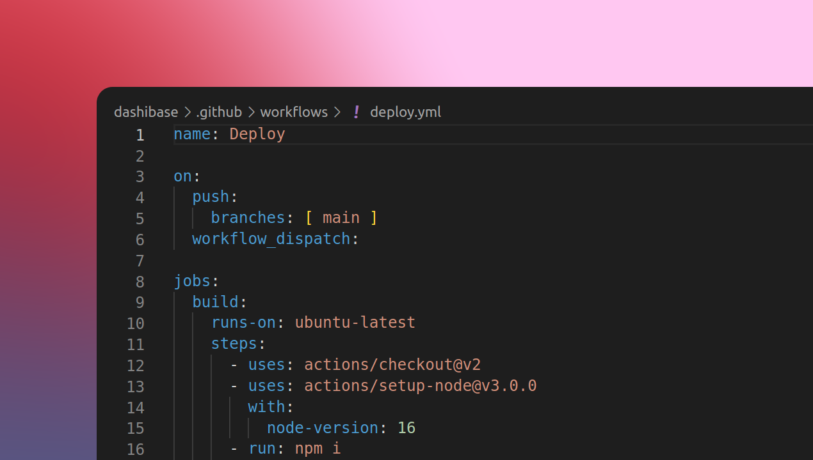

## Syncing our open-source repo with our production client

As of today, the dashboards hosted by the Dashibase app are based directly on our open-source [repo](https://github.com/dashibase/dashibase), deployed via GitHub Actions.

Prior to this, we were actually maintaining separate repositories, primarily because of technical debt and some unfinished features that weren't ready for public eyes. This change means that any improvements and bug fixes made to the `main` branch of our open-source repo will be reflected directly on our users' dashboards and vice versa.

We have more thoughts on this but for now here's a highlight of advantages that comes with this move:

- Reduce technical debt from having to maintain multiple repositories
- Integrate community contributions into actual product
- Allow community to help spot bugs and vulnerabilities in actual product
- More 'open-sourcey' :D

Ant from Supabase also wrote [a post](https://supabase.com/blog/2022/03/25/should-i-open-source-my-company) about this.
