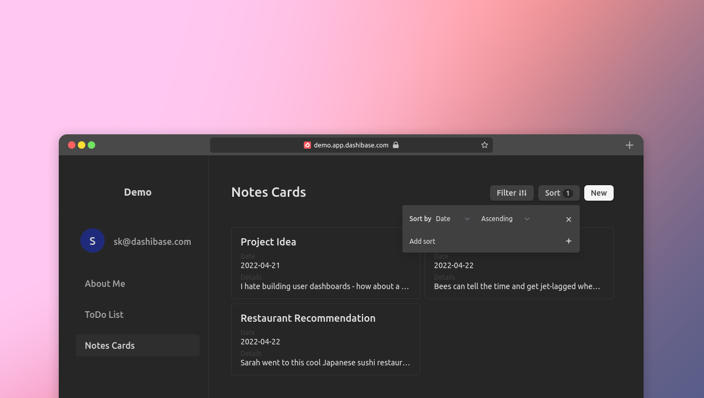

## Filter and sort

Both Card and List views now come with filter and sort support out of the box. You and your end-users can now filter and sort based on any attribute and combine multiple filters and sorts.

The filters currently only accept text input, with attribute-type-specific inputs coming soon!

## Dark mode

For all night owls and pseudo-vampires, our long awaited dark mode is now available. We also made a couple of UI updates including slimmer buttons and more elegant transition effects on hover.

## Fixes and improvements

- Support asynchronous querying of database, so that updates are reflected immediately
- Improve page transitions by enabling nested route transitions
- Support multi-select for deletion in List and Card views (hover over item index for checkbox in List view and shift-click in Card view)
- Boolean is now a toggle element instead of dropdown
- Update user icon to a more modern version based on user initials
- Add delete confirmation before any delete event
- Dashboard is now full-width even for large screens
- Add "No items found" message if no items are found in Cards or List view
- Fix bug where item creation and deletion sometimes does not reflect immediately
