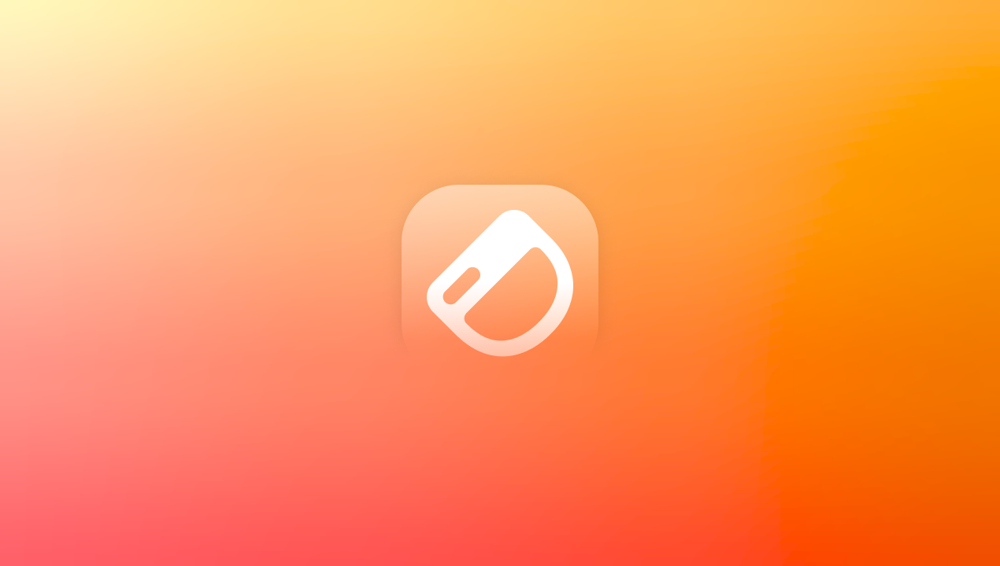

## Modern app UI

The apps you build with Dashibase will have a more modern UI. We consulted several UIUX and product designer friends and pored over numerous articles to improve the look and feel of dashboards created with Dashibase. This included small (yet big) details: What is a good way to present data on cards? What should the hover effect on different elements be? What shades and contrasts are good for dark mode? (Did you know pure black is not great because nothing, in reality, is pure black so it looks jarring!)

On that note, we’re always collecting feature requests and suggestions. Let us know!

## Improved Dashibase experience

The current Dashibase app was an MVP we coded up in four days. The new UI will make it easier and faster to build and edit your apps. A few highlights:

- No need to manually type your Supabase tables and column IDs (and can avoid typos).
- Dashibase will fetch them for you, and you can select them via a dropdown.
- You can edit your attributes on the attributes table directly, saving you extra clicks.
- An in-page resizable preview while you are editing your app.
- Once you are familiar with Dashibase and want to go even faster, you can edit your apps by directly updating the underlying JSON.

## New website

In line with our product update, we have also updated our website. We value craftsmanship a lot and look up to companies like Linear, The Browser Company, Superhuman, and Stripe. Besides making a great product, we also push ourselves to ship great-looking websites.

## Fixes and improvements

- 
