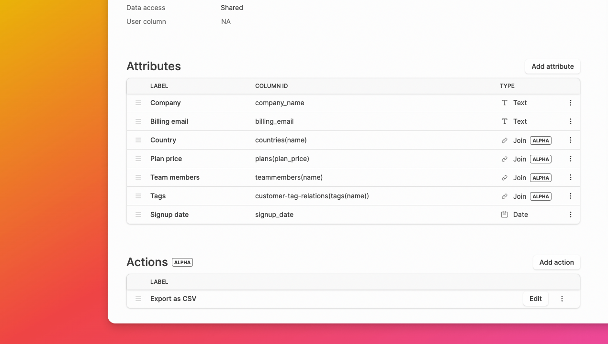

## Table joins (Alpha)

Have related data in multiple tables? You can now easily display and edit your data across multiple tables with your Dashibase dashboard. All without writing a single line of SQL.

Column IDs of joined tables are displayed as `table (column)` in Dashibase, so that you know that is column from a joined table.

## Actions (Alpha)

Early users have told us they want more than a CRUD dashboard. We are experimenting with a new feature for adding custom actions to your dashboard. 

For now, you can trigger a custom JavaScript function with the selected items and user as parameters. 

## Data access: Shared or Individual

Depending on your use case, you might want everyone using your dashboard to access a common set of data (e.g. managing company inventory) or individual users to access only their own data (e.g. managing personal contacts or blog posts).

You can now set the data access for each page as "Shared" or "Individual". 

- Shared: Every user of your dashboard can see all data for that page. 
- Individual: Every user of your dashboard can only see their own data for that page. 

In both cases, you can use "Read-only" to set the edit access.

## Improvements and bug fixes

Improvements

- When the "Save" and "Deploy" buttons are disabled, hovering over them now shows an explanation.
- The user profile photo in the menu in mobile screens has been updated to the new style.

Bug fixes

- Save button was automatically enabled when there were no changes. This has been fixed.
- Save didn't work when editing JSON. This has been fixed.