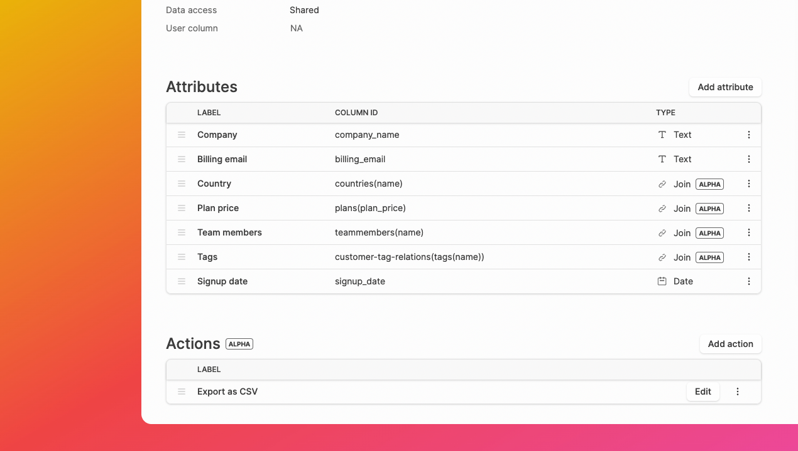

## Public roadmap

We now have a [public roadmap](https://dashibase.com/roadmap)! 

We will be updating it regularly so that you know what is coming up in the current month and beyond. You can also join [our Slack community](https://join.slack.com/t/dashibase-community/shared_invite/zt-180rycyqv-ifRwyiQAiXUlBBVxgxQE7g) for sneak previews and follow us on [Twitter](https://twitter.com/dashibase) for more regular updates. 

If you have any feature requests or feedback, [let us know](mailto:sk@dashibase.com).

## Table joins (Alpha)

Have related data in multiple tables? You can now easily display and edit your data across multiple tables with your Dashibase dashboard. All without writing a single line of SQL.

Within the Dashibase app, column IDs of joined tables are displayed as `table (column)`, so you know that is a column from a joined table. We support up to two-degree joins, catering for join tables, so something like `table_a (table_b (column))` would work as well.

When rendering your dashboard in item or single views, Dashibase detects if the input type should be a dropdown or a multi-select and [uses the appropriate inputs](https://twitter.com/sweekiat_lim/status/1535653890258894849?s=20&t=4LPZon3L7gZvQetZVm91bw). When rendering in list or card views, [dropdown inputs render as text, while multi-select inputs render as badges](https://twitter.com/sweekiat_lim/status/1535001508177055744?s=20&t=rsCTNf9w-BYKjQSRMYi74Q). All CRUD features are supported with table joins as well - Dashibase automagically updates the correct tables to create the correct relations.

Open-source users can try this out by specifying `table (column)` as the column ID and setting the attribute type as `AttributeType.Join`.

## Actions (Alpha)

Many of you have told us that custom actions, webhooks, and triggers are important for your use cases. We are experimenting with a new feature for adding custom actions to your dashboard. 

For now, you can trigger a custom JavaScript function with the selected items and current user as parameters. You could use this to trigger a prompt, export the data, send an email (through your email service provider), and more.

If you are using the open-source repository, actions can be added via the `trigger` attribute of a page. See an example at the [sample config](https://github.com/Dashibase/dashibase/blob/25cd4ff17209c6afb389da2a808a636d2e41f588/src/dashibaseConfig.ts#L43-L50) and some details in the [config.ts file](https://github.com/Dashibase/dashibase/blob/25cd4ff17209c6afb389da2a808a636d2e41f588/src/utils/config.ts#L54-L64).

More documentation will be provided as we develop this feature.

## Data access: Shared or Individual

Depending on your use case, you might want everyone using your dashboard to access a common set of data (e.g. managing company inventory) or individual users to access only their own data (e.g. managing personal contacts or blog posts).

You can now set the data access for each page as "Shared" or "Individual". 

- Shared: Every user of your dashboard can see all data for that page. 
- Individual: Every user of your dashboard can only see their own data for that page. 

In both cases, you can use "Read-only" to set the edit access.

In the open-source repository, this can be set via the [`enforce_user_col`](https://github.com/Dashibase/dashibase/blob/25cd4ff17209c6afb389da2a808a636d2e41f588/src/utils/config.ts#L27) property of a page.

Credits and thanks to [@joel](https://github.com/OneFishTwoFishRedFish-JFish) for contributing this feature, as well as being the first contributor to the Dashibase open-source repository!

## Fixes and improvements

Improvements

- We now support JSON and JSONB data types, to be used with the text or long text attribute type in the Dashibase app. JSON and JSONB are also supported in the open-source repo.
- Your end users can now click on # on a table to select all items on the page.
- When the "Save" and "Deploy" buttons are disabled, hovering over them now shows an explanation.
- The user profile photo in the menu in mobile screens has been updated to the new style.
- The attribute type dropdown menu now includes icons for visualizing the input type.
- All input elements in the Dashibase app shows a border on hover. 
- The "New", "Save", and "Delete" buttons are hidden for read-only pages.
- When there is no page or attribute in the Dashibase app, we now show an empty state.

Bug fixes

- Deleting items is no longer possible for read-only pages.
- The "Save" button was automatically enabled when there were no changes. This has been fixed.
- Save didn't work when editing JSON. This has been fixed.
- Slight styling difference for the filter and sort buttons between the preview and actual dashboards have been fixed.
- The styling of the nav bar of dashboards on the mobile now has the same x-padding as the rest of the elements on the page. 
- Dark mode no longer disappears upon refresh. 
- The broken boolean style for read-only has been fixed.
- The filter popup of dashboards no longer go behind the side panel on small screens.
