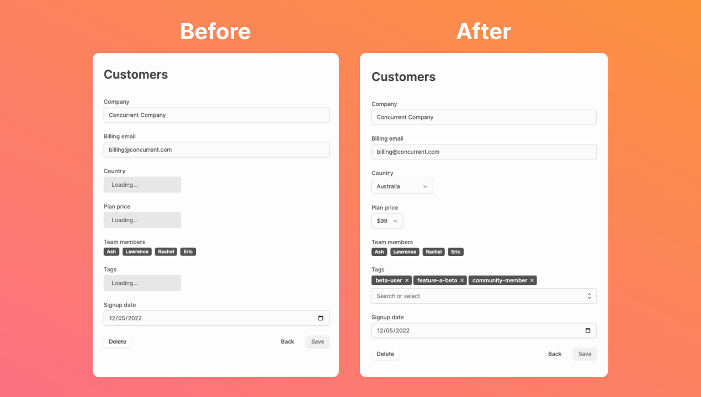

## Refactoring

After a few weeks of pushing new features out, we took this week to tidy up our code. There isn't major visual changes but you should feel that the Dashibase app and your dashboards are loading faster and are more stable. 

For example, it used to take the joined attributes a few seconds to load. They load instantly now. 

## Documentation for joins and actions

## Improvements and fixes

Improvements

- You no longer need to set your ID column for each of your pages because we now automatically get that information from your Supabase schema. (Yay to removing things!)
- Pagination in the dashboards is now a text input so that it's easier to skip to further pages. 
- We now use custom components for filter and sort in the dashboards, which look more modern and fixed some styling issues.
- The colors of tags have been improved. (Thanks, [Ben Issen](https://www.supercreative.design/), for giving us the feedback that they looked like buttons!)

Bugs fixes

- The filter option in dashboards would break if you use `varchar` in Supabase. This has been fixed.
- Some dashboards would not load if the dashboard metadata was cached before we added the "Actions" feature. We have fixed this. (Thanks, Joel Fisher, for bringing this up!)
- "Trigger" has been renamed to "Action" throughout the Dashibase app for clarity.

If you notice any breaking bugs, feel free to ping us in [Slack](https://join.slack.com/t/dashibase-community/shared_invite/zt-180rycyqv-ifRwyiQAiXUlBBVxgxQE7g). Otherwise, it'll be awesome if you want to add them as issues to [our open source repo](https://github.com/Dashibase/dashibase/issues).