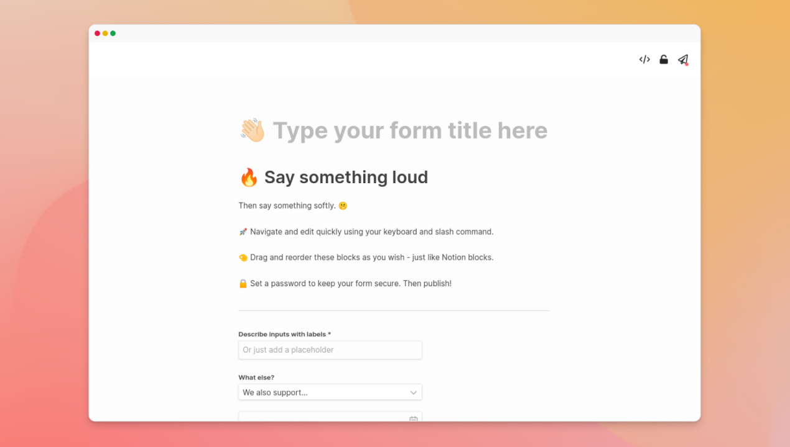

## Dashibase Insert

You have told us alternatives are hard to learn, don't have a good UI for you and your team, and don't scale with your project. We realized that Dashibase has the opportunity to become _the_ tool to help you build _beautiful_ admin dashboards for your team in just _minutes_. 

Here's our first of many product improvements to achieve that: **A Notion-like form builder for Supabase**.

You can easily create forms for your teammates to add data to your Supabase table.

- The form is automatically populated with the required columns in your Supabase table.
- You can navigate and edit quickly using your keyboard, slash command, and basic markdown formatting.
- You can set a password to keep the form secure.

This tool is absolutely free! Give it a go at https://dashibase.com/insert. 

Over time, we will integrate this new UI into Dashibase so that you can build and customize your dashboards this easily too.

## User management and custom roles

You need user management in your dashboards. We hear you loud and clear! 

We wanted to let you know we are thinking hard about it right now, sketching the UI and figuring out the technical implementation.

If you have any suggestions on what this feature should be like, please feel free to reach out in [our Discord server](https://discord.gg/CqgZGh4ZA8) or [via email](mailto:sk@dashibase.com) and help shape the feature.

## New blog

We now have a proper blog on our website! We will be sharing our startup journey, product updates, tutorials, and more.

Check it out at: https://dashibase.com/blog.

## Bug fix

There was an issue where the user column was inserted as NULL when a new entry was added to Supabase. This has been fixed. Thanks [Allan Whatmough](https://www.linkedin.com/in/allanwhatmough/?originalSubdomain=au) for bringing this up! 
