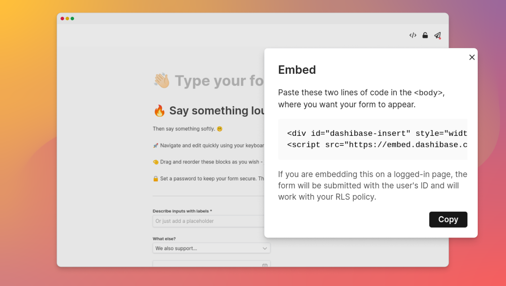

## Embed your forms

You can now embed the forms you create with [Dashibase Insert](https://dashibase.com/insert) on your website. Just copy the two lines of code and paste them wherever you want on your website. 

```
<div id="dashibase-insert" style="width: 100%; height: 800px; margin: auto;" />
<script src="https://embed.dashibase.com/insert/embed.js" dashibase-key="(Your form key)" />
```

You can adjust the width and the height of the form via the styles in the embed code. 

If you have set up [RLS policies in Supabase](https://supabase.com/docs/guides/auth/row-level-security), your users will still be able to submit the form on a logged-in page because the forms support auth. You can also set up triggers to automatically insert the user's id with their entry. 

P.S. As always, we made an [open-source version](https://github.com/Dashibase/dashibase-insert) of Dashibase Insert. For the curious, check out how we built the Notion-like interface with Vue in [`src/components/editor`](https://github.com/Dashibase/dashibase-insert/tree/main/src/components/editor).

## Fixes and improvements

Dashboards

- The filter function used to break if the first attribute is a number. We have fixed that and added filter support for all data types. Thanks, [Ludovic](https://twitter.com/ludoludi), for raising this!
- The preview URL was showing `app.supabase.com`, instead of `app.dashibase.com`. Thanks, [Zernonia](https://twitter.com/zernonia), for pointing it out!

Forms 

- Previously, required blocks cannot be deleted from your forms unless they are set as not required. We realized that is a confusing experience, so you can now delete required blocks. (But if it is a required column in your Supabase project and you are not generating the value automatically, you will get an error when submitting the form.)
- The long text input block for forms now shows at least three lines even when there is no text.
- The options menu is now more responsive on smaller screens. It used to be cut off on smaller screens - another bug reported by [Zernonia](https://twitter.com/zernonia), thanks again!
