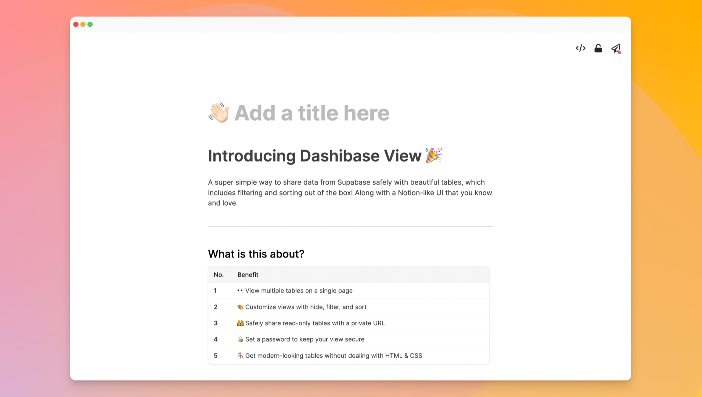

## View your Supabase data in beautiful tables

[Dashibase View](https://dashibase.com/view) is a simple way to display your Supabase data in beautiful tables and safely share them with your team.

- View multiple tables on a single page
- Customize table views with hide, filter, and sort
- Safely share read-only tables with a private URL
- Set a password to keep your table view secure
- Get modern-looking tables without dealing with HTML & CSS
- Embed table views on your website (coming soon)

You can check out an example of [a published table view here](https://insert-dev.dashibase.com/t/9cf9616d-bea5-40af-abaa-6112e010e1a7). The super-secret password is `supatable`.

As promised, this is also free to use. Just [sign up](https://dashibase.com/view) or [log in](https://insert.dashibase.com/) to your existing account to get started. 

Quick notes:

1. Eventually, you will be able to build your dashboards via such an interface.
2. We are figuring out the open-source version of this. Any contributions will be appreciated!

## Improvements

- The options menu in Dashibase Insert used to be cut off at the top. This has been fixed. 
- Long text blocks for your published forms is now a `textarea` element and shows at least three lines even when there is no text. It used to be a one-line `input` element.
- Increased padding for Dashibase Insert inputs and increased font size of labels.
- The copied code for embedding a Dashibase Insert form had a typo in the script source. This has been fixed.
- Added closing tags to embed code so that it would render even in regular HTML files.
- Fixed a cosmetic bug where the reveal/hide icon for setting a password was out of place.
- The [open-source repository](https://github.com/dashibase/dashibase-insert) for Dashibase Insert had some bugs with authentication and the Publish button not appearing when self-hosted. These have been fixed, thanks to Martyn Shiner for reporting these bugs! 

## PS. We're hiring!

Love reading changelogs? You might be the one we're looking for. Learn more [here](https://dashibase.com/blog/builders/)!
