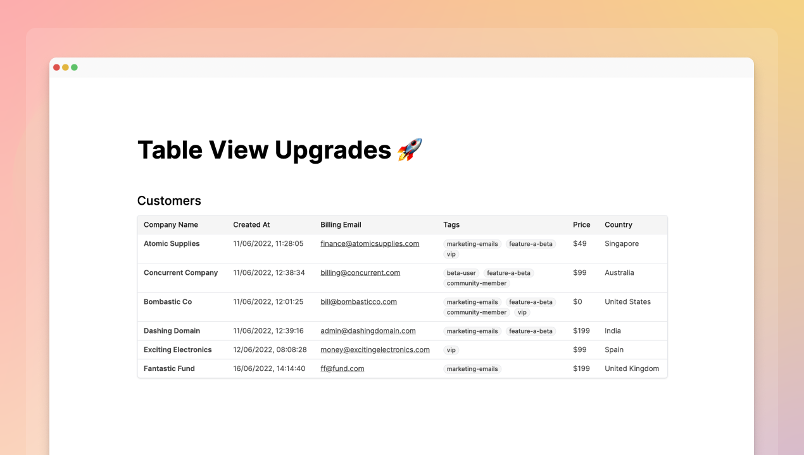

## Table view upgrades

We launched [Dashibase View](https://dashibase.com/view) last week and have since added a few improvements to it:

1. **Joins:** If your data is in multiple related tables, you can now easily display them on your tables. They are hidden by default when you add new tables. You just have to toggle the show/hide setting to show them. Oh, and you can rename the column header.

2. **Auto-formatting:** When your data contains URLs, email addresses, or arrays, they will be automatically formatted accordingly on your table view. 

3. **Embed:** You can now embed your table views anywhere on your website, just like [your forms](https://dashibase.com/insert). If you are embedding your table view on a logged-in page, the table data will be retrieved with the user's ID, following your RLS policies, if you have any. 

4. **Custom CSS:** We strive to make your tables look great right out of the box. But sometimes, you would want to style them according to the theme of your website. You can now style the embed, text, table, button, and more via [these CSS selectors](https://dashibase.com/docs#style).  

If you want to create a public or private view of your Supabase data for other to check out, give [Dashibase View](https://dashibase.com/view) a try. Here's [a cool example from a community member, Zernonia](https://twitter.com/zernonia/status/1547024626986803200).

## Auto-formatting in Dashibase

Similarly, URLs, email addresses, and arrays, will be automatically formatted accordingly on your Dashibase dashboards.

Thanks, [Zernonia](https://twitter.com/zernonia), for asking for this and providing suggestions on how we can do it.

## Fixes and improvements

Dashibase View & Insert

- Published table views and forms are now responsive.
- After publishing, the share modal will appear automatically to save you a step.
- The share modal is now responsive so that you can grab a link to your table view or form on mobile.
- The location of Dashibase branding is shifted to the bottom of embeds so that it's less annoying.
- The table menu now aligns to the right of the tables so that the tables look neater. It used to be at the far right end of the page.
- Opening a block's menu closes the side panel to make editing easier. 
- Fixed a bug that didn't allow users to click and put their cursor in the middle of a column header to edit.
- Fixed a bug that made it impossible to create a new block when all existing blocks were deleted.
- Fixed a bug where columns don't show data after being hidden and unhidden. 
