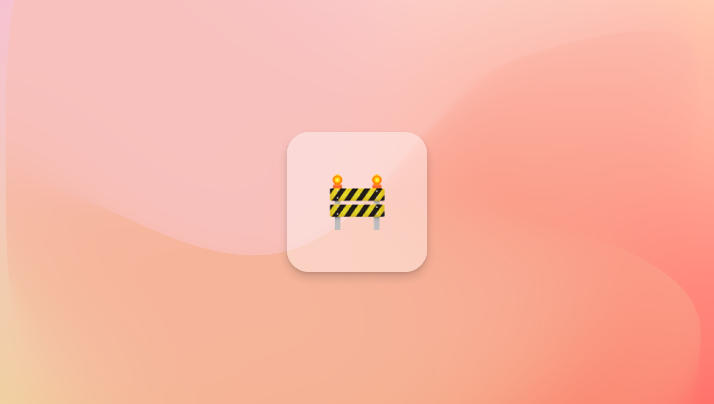

## Reflections and refactoring

After spending a month pushing out two free tools, [Dashibase Insert](https://dashibase.com/insert) and [View](https://dashibase.com/view), we decided to take a week to reflect on the responses, revisit our product direction, and tidy our code. We are also grateful for the conversations with senior tech folks at companies like Sequoia Capital and Openspace Ventures to help clarify some of our ideas. 

We are spending the next two weeks pushing a major update to Dashibase. As mentioned in the previous weeks, we will be integrating the Notion-like UI into Dashibase so that you can more easily create your dashboards. We will also be adding a few other features, such as user permissions and data access control.

Join us in [our Discord server](https://discord.gg/CqgZGh4ZA8) to get early access and help us test it. 

## Open-source Notion-like editor

We [believe the Notion UI](https://dashibase.com/blog/notion-ui/), with its slash command, draggable blocks, and markdown formatting, will become the new UI standard for most software. 

To help accelerate the adoption and in line with our open source principle, we [open-sourced our Notion-like editor](#linktogithub)! 

Play with our demo at https://lotion.dashibase.com/. 

P.S. We would love any contributions to add more blocks, such as images, videos, or code. 

## Moving to Discord

After a few weeks of experimentation, we have moved our Slack community to [Discord](https://discord.gg/CqgZGh4ZA8). 

- Discord is built more for communities than Slack.
- Developers generally prefer Discord to Slack.
- Supabase’s community is on Discord, so it’s easier if we are on Discord too.

Join us [there](https://discord.gg/CqgZGh4ZA8) to ask questions, share your projects, and support one another!

## Fixes and improvements

- Fixed a bug that breaks a table when adding a column from a joined table.
- Fixed a bug where tables cannot be added because of an issue with passing null values. 
- Fixed a bug where the blocks were not draggable by the menu button in Safari. Thanks, [Debabrata](https://twitter.com/0xDebabrata), for reporting this.
- Fixed a bug where pagination was not showing. Thanks, [Abudhakeer](https://www.linkedin.com/in/abudhakeer-s-56925b69/), for reporting this.