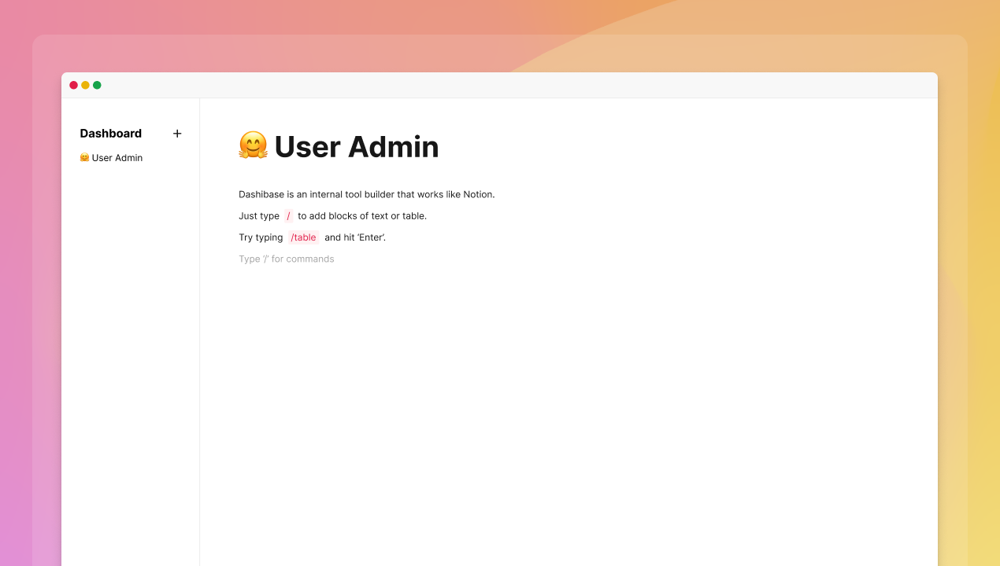
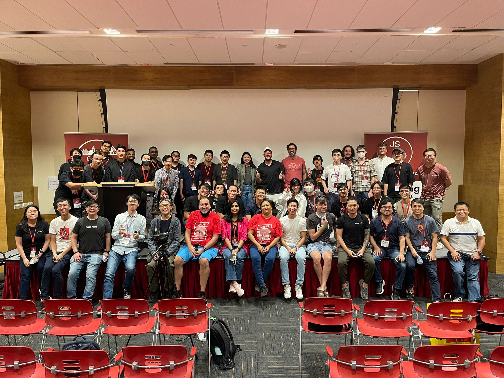

## Work-in-progress

We have been working on integrating the Notion-like UI into Dashibase and adding data access control and user permissions. We are still on track to ship them next week!

If you would like early access to the new Dashibase, join [our Discord](https://discord.gg/rUw2snFeUZ) where we will be looking for testers this week. 

## Lotion 🧴

As you might know, [Lotion, our open-source Notion-like editor](https://github.com/Dashibase/lotion), will be a major part of the new Dashibase. It blew up last week. It now has more than 1,600 stars and [is trending on Github](https://twitter.com/dashibase/status/1553945080641204224)! 

We are grateful to contributors [ivteplo](https://github.com/ivteplo), [holazz](https://github.com/holazz), [vvidday](https://github.com/vvidday), and [PJerkovic](https://github.com/PJerkovic) for helping to improve Lotion and fix bugs. For example, they have helped to add the H3 block, make blocks draggable only by the menu icon, enable markdown formatting for existing text blocks, and [more](https://github.com/Dashibase/lotion/pulls?q=is%3Apr+is%3Aclosed). More contributions are welcome!

We will be turning Lotion into a npm library so that it will be easier for others to use it in their projects.

## CityJS Singapore

We had the privilege to speak at and sponsor [the CityJS Singapore conference](https://singapore.cityjsconf.org/) last week. 

It was great fun hanging out with the local developer community and sharing our ideas. We talked about why we believe [the Notion UI is becoming the new standard](https://dashibase.com/blog/notion-ui/) and how to implement part of it (via Lotion!)

If you think there's a conference or meetup we should attend or speak at, [let us know](https://discord.gg/rUw2snFeUZ). We love sharing our experiences and ideas on web development, product design, and startups. 

