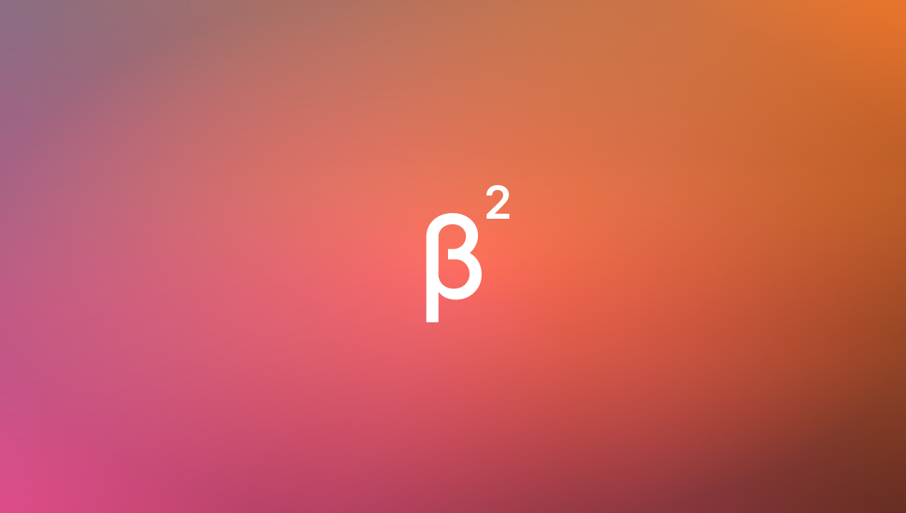

## New Dashibase preview and testing

After two weeks of long, long days, we are finally ready to share an early preview of the new Dashibase! It took a little longer than we had hoped but here we are. Thank you for your patience!

With the new Dashibase, you can:

- Connect multiple databases and set granular table- and column-level access (aka data resources)
- Build modern CRUD dashboards through a Notion-like interface (powered by [Lotion](https://github.com/dashibase/lotion))
- Share use or edit accesses to your dashboards and data resources to your teammates

We are giving access to the new Dashibase to community members in [our Discord](https://discord.gg/rUw2snFeUZ) first. Join the community if you would like to skip the waitlist.  

Quick word of caution: Do expect some bugs. We do not recommend trying our preview version on your production databases. Or yolo! (No, just kidding. Please don't.)

## Fixes and improvements

Lotion

- Added the quote block (by [exposir](https://github.com/Dashibase/lotion/pull/32), [vvidday](https://github.com/Dashibase/lotion/pull/34), and [KKKZ0Z](https://github.com/Dashibase/lotion/pull/37))
- Added unique id to blocks (by [lyqht](https://github.com/Dashibase/lotion/pull/45))
- Improved keyboard navigation within the block menu (by [KKKZ0Z](https://github.com/Dashibase/lotion/pull/21))
- When hitting "Backspace" at the start of a non-text block, the block now turns into a text block, instead of combining with the block above (by [KKKZ0Z](https://github.com/Dashibase/lotion/pull/38))
- Removed '/' after changing a block's type with the slash command (by [vvidday](https://github.com/Dashibase/lotion/pull/33))
- Fixed a bug where deleting a header block broke the block above (by [vvidday](https://github.com/Dashibase/lotion/pull/23))
- Fixed a bug that threw an error when the first line is deleted (by [holazz](https://github.com/Dashibase/lotion/pull/24))
- Fixed a bug that created unnecessary \  elements when hitting "Enter" (by [vvidday](https://github.com/Dashibase/lotion/pull/26))
- Fixed an error when turning a heading block into a text block (by [holazz](https://github.com/Dashibase/lotion/pull/31))
- Fixed carret position after changing a block's type with the slash command (by [vvidday](https://github.com/Dashibase/lotion/pull/33))
- Fixed a bug that occurred when combining two heading blocks (by [vvidday](https://github.com/Dashibase/lotion/pull/36))
- Removed outline style in Safari (by [holazz](https://github.com/Dashibase/lotion/pull/28))
- Refactored text block check (by [exposir](https://github.com/Dashibase/lotion/pull/44))
