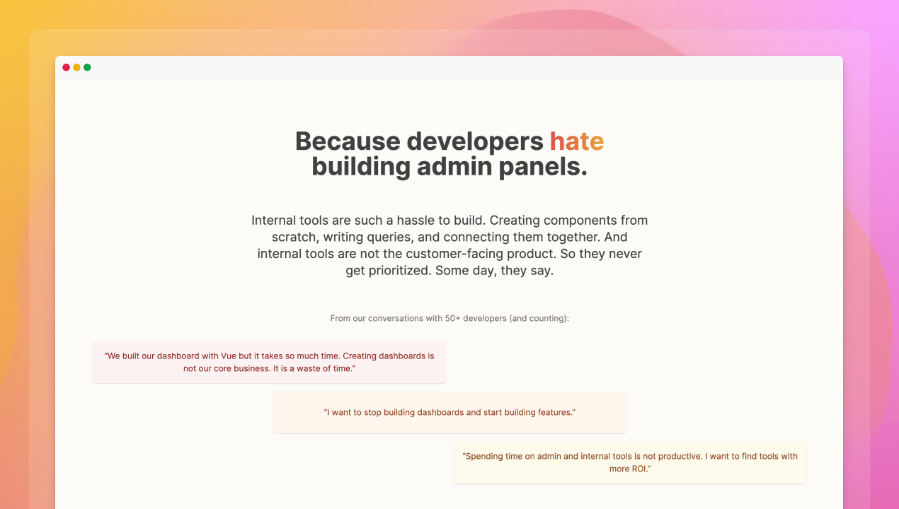

## A fresh coat of paint

After having 50+ conversations with developers, iterating on our vision, and shipping a new beta, our once-amazing website had become outdated. As we ramp up our beta testing again, we are excited to share our new website.

New demo, better information, more screenshots and, of course, animations!

Check it out at [dashibase.com](https://dashibase.com/) and [tweet us what you think](https://twitter.com/dashibase).

In line with that, we are resuming our onboarding calls. We have about 500+ folks on our waitlist that we have not contacted and will asap. Thank you for all your patience! We can't wait to show you the new Dashibase and let you try it.

## Ship once, iterate often

After shipping our beta last week, we received many helpful feedback. What we thought was intuitive totally stumped our users. Big shoutout to our community members, especially those who tested it live with us.

Here are some things we added since our release last week:

- Track unsaved changes and prompt users to save before they leave the dashboard
- Added the ability to support tables with more than one foreign relation to another table
- Separated the shown and hidden columns of each table in the table menu
- Added the ability to reorder pages of a dashboard
- Automatically transform column names on the frontend (e.g. `company_name` to Company Name)
- Added a refresh button to all tables so that users can manually refetch the data if the real-time sync is slow
- Added buttons to the list of blocks for the single-item view
- Added a prompt to connect a data source if users try to create a dashboard without one
- Improved copy to make things clearer (e.g. "Resources" to "Data sources", "Team" to "Organization", add item name to delete confirmation modal)
- Improved styling (single-item view buttons, Back button's position)

## Fixes and improvements

- Fixed a routing bug where opening a second tab of Dashibase shows a blank page
- Fixed a bug where the table column order isn't saved
- Fixed a bug where adding a sort breaks the sort buttons
- Fixed a bug where joined tables do not have a title
- Fixed an error in updating items
- Fixed a bug which removes data from an input when switched to Short Answer
- Fixed a bug with deleting a resource that is used by at least one dashboard
- Fixed a styling issue with the sort dropdowns
- Fixed a bug that prevented scrolling