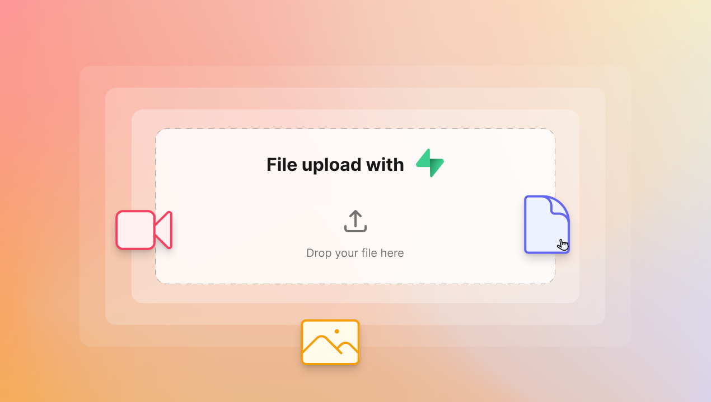

## File upload for Supabase users

Rejoice, Supabase friends! 

We now support file storage via [Supabase Storage](https://supabase.com/storage). To allow your team to upload images, videos, files, etc. to your Supabase project, simply convert the respective input block into "File Upload". 

We will ask for your Supabase Service key to minimize the setup you need to do. Just select or create a bucket for your Supabase Storage, and you are good to go!

## Preview mode

You might not know, you can actually use your dashboard to add and update your data while you are editing it. 

But since this wasn't very clear, we added a "Preview mode" so that you can safely use your dashboard to view and update your data without accidentally editing your dashboard. This is similar to an organization member having "Use dashboard" access, where they can only use but not edit the dashboard. 

This feature is available to everyone, even on the Free plan. 

## Lotion npm library

We finally published [an npm library for our popular Notion-like editor repo, Lotion](https://www.npmjs.com/package/@dashibase/lotion)! Within a day or two, there are 156 downloads already.

If you want a modern editor for your app, feel free to give Lotion a try. We will appreciate any contributions too.

(Quick shoutout to our contributors so far: [vvidday](https://github.com/vvidday), [hola](https://github.com/holazz), [KKKZOZ](https://github.com/KKKZOZ), [zhangenming](https://github.com/zhangenming), [ivteplo](https://github.com/ivteplo), [exposir](https://github.com/exposir), [lyqht](https://github.com/lyqht), [PJerkovic](https://github.com/PJerkovic))

## ViteConf Community Partner

We build our website, app, and tools with [Vite](https://vitejs.dev/), so we are excited to be a Community Partner for [ViteConf](https://viteconf.org/).

It is happening online on October 11-12. [Grab your free ticket](https://viteconf.org/tickets/alfredlua?awesome) (which you can theme with the Dashibase logo)!

## Welcome Debabrata Mondal onboard!

Lastly and most importantly, Debabrata Mondal has just joined the team to help us move even faster.

We were (and still are) impressed by the projects he has shipped: Fireplace, Commonplace, Temporal (which interestingly enough overlaps with our previous idea [Catche](https://catche.co/)). Deb will be focusing on engineering but as with all startups, there are a lot to do. We are thrilled to get his help with all the things (design, community, support, and more).

Follow him on [Twitter](https://twitter.com/0xDebabrata) and [Github](https://github.com/0xDebabrata), and check out his main project, [Commonplace](https://www.commonplace.one/).

## Fixes and improvements

- Truncate email address in the organization switcher if it is too long
- Fixed a bug that breaks the app when users first try to connect a data source