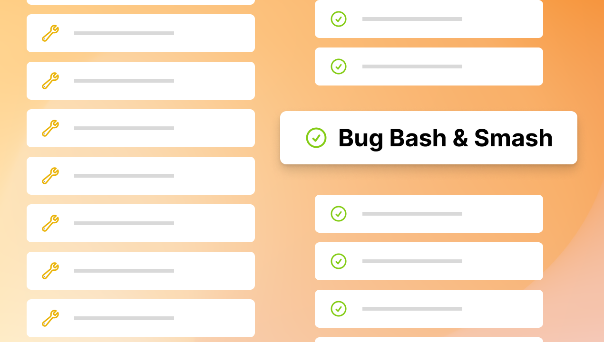
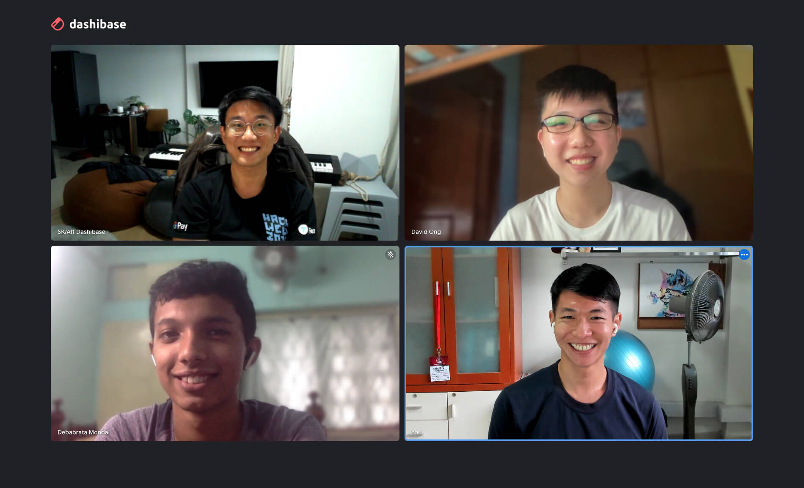

## Bug bash and smash

Because we want our products to be and feel polished, we ran a bug bash and smash session throughout the past week. 

Bug bash is a practice in software development where people across teams, beyond the engineers, put aside their day-to-day work and come together to test the product. Dashibase is fairly small in scope, so we could test the entire product (while most bug bashes would have a limited scope). We prepared a checklist of things to test and a guide on how to record issues in Linear. In total, we recorded 90 issues, which included bugs, quality-of-life (QOL) improvements, and potential features.

Bug smash is our own addition to bug bash. While we would usually fix several bugs every week, even if they are not urgent, we wanted to dedicate one to two weeks to "smashing" as many bugs as possible. We managed to fix 44 issues (30 bugs and 14 QOL improvements) in the past week. Quick shoutout to Deb for fixing 3 issues within his first week of joining! 

Here's a list of the issues we fixed in the past week:

**Bugs**

- `datetime` column is showing "Invalid Date"
- Joined table are not showing up in the single-item view
- App hangs when user tries to change an existing input block to a new input block
- App hangs when user creates a new dashboard then exits and discard changes
- Joined tables in the single-item view show no data
- New text block gets created when pressing Enter to apply filters
- Unsaved changes are not computed once user discards changes once
- Read-only field can be edited on the frontend
- Deleting a header block adds "undefined" to the previous block
- New item page has the "Delete" button
- Clicking on a read-only table on the Set Access page crashes the page
- Refreshing an unsaved dashboard is allowed and breaks the page
- Data cannot be fetched if user logs in, switches organization, and opens a dashboard
- Backspace on a 1-character line deletes the line and moves the character to the block above
- Logged-in user is not redirected to the app when visiting /login or /signup
- "And/Or" selection box is too long, causing the condition field to be cut off
- Placeholder is not shown when converting an empty block to a heading block with the block menu 
- "##" remains after the block is converted into a Heading 2 block
- Filter/sort/columns menu does not close when another is opened
- Error in demo dashboard copy
- Dashboard user (not editor) can add a new block in the dashboard by pressing Enter
- Use access dropdown options are shown by default, which obstruct information
- User prompted to save changes when there are no unsaved changes
- User could "connect" a data source even if they do not fill in any connection details
- Removing team members doesn't actually remove the user unless you do it twice
- Data resources page shows "Can edit" when the user has no access
- Divider does not appear if user adds it via the block menu
- When filtering columns, "contains" only shows full matches
- User is prompted to connect a data source, despite having edit access to a data source within the organization
- Page title breaks when renaming from Untitled

**QOL improvements**

- Saving an item shows a loading state before return to the main page to provide users with feedback
- Clicking the eye icon in the Columns menu to show or hide columns no longer close the Columns menu (which is annoying when you want to show or hide multiple columns quickly)
- Pressing Enter on the page title adds a new block below it
- Existing users are prompted to log in when they try to sign up
- Backspace at the start of an input label no longer deletes the input block
- Backspace at the start of a new line after an input block no longer deletes the input block above
- Backspace after a table no longer deletes the table
- New signups are redirected to their account immediately (instead of having to log in via the confirmation email)
- Databases with no tables cannot be connected, and user will see an error message
- Filter condition field clears when I switch to a new column to filter
- Dropdown box query clears after selecting a dropdown option
- Updated "resources" copy to "data sources" for consistency
- Added padding between "Save" and "Share buttons"
- Dropdown options' width is the same as the dropdown box

Several bugs were also reported by the community. Big thanks to folks like [Allan Whatmough](https://www.linkedin.com/in/allanwhatmough/), [Fernando Pintado](https://www.linkedin.com/in/fernandopintado/), Justin Barak, [Estee Tey](https://twitter.com/estee_tey), and [Fabian Morón Zirfas](https://www.linkedin.com/in/fabian-mor%C3%B3n-zirfas-5288326a/?locale=en_US) for being patient with us as we look into and fix the bugs.

## Welcome David Ong onboard!

Dashibase is growing again! This time, we are welcoming our most active open-source contributor, David Ong!

When [our open-source repo Lotion](https://github.com/Dashibase/lotion) went semi-viral, several people started contributing to it. David quickly became [the top contributor](https://github.com/Dashibase/lotion/graphs/contributors), right behind SK who created the repo. David added new features, fixed bugs, and implemented tests. 

We are excited to have him on the team officially. Similarly to Deb who joined us last week, David will be focusing on engineering and helping out across the board.

You can find him on [Github](https://github.com/vvidday) and [LinkedIn](https://www.linkedin.com/in/david-ong-b02655248/).

[Join us in welcoming him!](https://twitter.com/dashibase/status/1566784621521448962)
