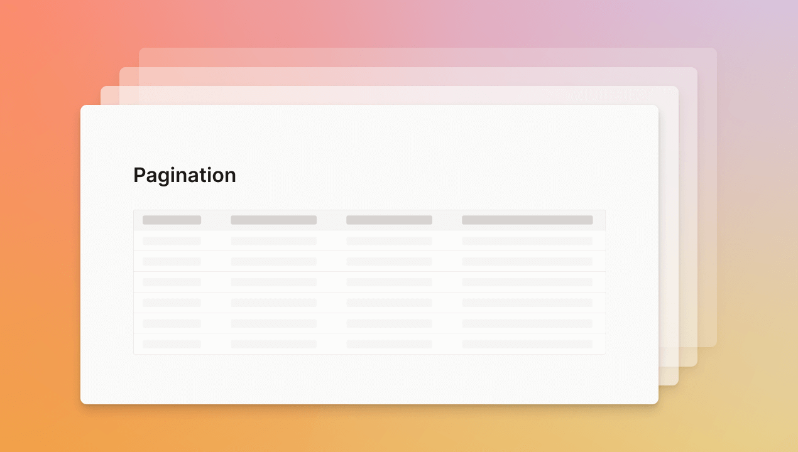

## Pagination

Imagine reading a book printed on a single long piece of paper. Just one really long page. That would be quite a mess, wouldn't it? 

That is the same for displaying data in an app. **And that's why Dashibase now supports pagination for your tables!**

Pagination allows us to divide a large data set into smaller chunks so that we can quickly get a chunk of data and immediately display it on your table, instead of waiting for the entire data set to be downloaded. You can use the "Next" or "Prev" buttons or skip to specific pages to view more data. 

*Well, why bother adding pagination? Why not show everything on a single page? Isn't clicking "Next" a hassle?*

All good questions! Pagination isn't really that necessary when you have a small database. You could very well display all your data on a single page. 

But when your database is huge, problems will come knocking on your door (or table). At the worst, a giant database could break the app and shut down the service for fetching the data (i.e. no data for everyone). At the least, it will make the app load very slowly because it has to process all the data. For example, dragging a table with thousands of records in Dashibase would cause other things to take a few seconds to load, which is a terrible experience. Just thinking about the last time you visited a website and it took more than five seconds—one thousand, two thousand, three thousand, four thousand, five thousand—to load anything on the page. Urgh!

Now with pagination, we fetch and show up to 20 records each time. Everything feels fast and snappy. Furthermore, you can now skip to a specific range of records within your table by entering a specific page number. No more scrolling and scrolling and scrolling...

## Fixes and improvements

- Fixed a bug that prevents users from connecting their database
- Fixed a bug where we were not escaping single quotes for inputs and updates could not be saved
- Fixed a bug that accepted invalid JSON as input and saved it to the database
- Fixed a bug that incorrectly converted JSON into string in the Short Answer and Long Answer blocks
- Fixed a bug that showed "No rows found" while saving a record
- Fixed a bug where the organization avatar is showing the wrong letter
- Fixed a bug where the loading is not cleared during signup if the password <6 characters
- Filter, sort, and hide are now applied invisibly in Preview and Use dashboard modes
- Filter and sort now persist, even when you navigate to other pages in the dashboard
- Tables now can have the full width of the page so that you can show many columns if you prefer
- You can now re-add a join table in a single-record view
- If creating or updating a record fails, you will now see an error message (instead of it failing silently)
- If the data entered does not match the column data type, an error message will be shown. Validation is done before the query is sent.
- If a record cannot be deleted due to a joined relationship, you will now see an error message that describes the relationship
- The dashboard name will now decrease in font size if the dashboard name has more than 16 characters. It will only be truncated if it still does not fit the space.
- The HTML page title is now updated to the dashboard name to help you navigate to the right tab when you have several open
- Dropdowns are now automatically populated with the first option
- Improved consistency of font size and alignment on the Set Access page
- Rewrote the confusing copy on the demo dashboard
- Made the copy of the error message easier to understand and friendlier when a data source cannot be deleted because one or more dashboards are using it
- Updated "User" and "Admin" to "Member" and "Organization Admin" in the Add team member modal to be consistent with the rest of the app
- The email address in the Add team member modal will now clear after adding the team member
- Any whitespaces before and after an email address, which is common when copying and pasting, will be automatically cleared when adding a team member (HT [Fabian Morón Zirfas](https://github.com/ff6347) for the suggestion)
- Added some spacing between the "Save" and "Share" buttons in the dashboard navbar
- Added tests for the `InputBlock`, `LongAnswerBlock`, `ShortAnswerBlock`, and `Dashboard` components