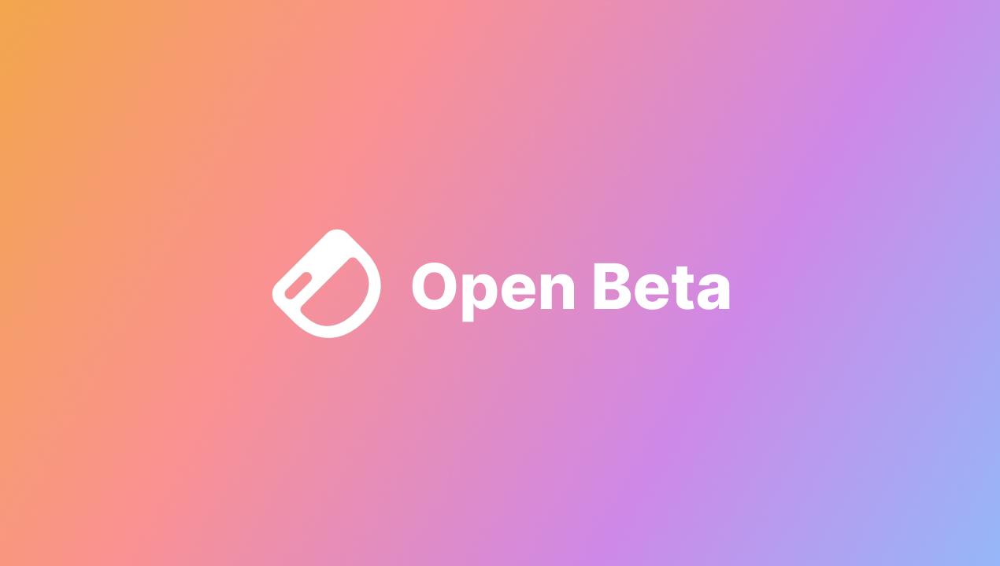

## Dashibase now availabe in open beta

After about a month of testing with our community, fixing issues, and improving the experience, we are finally ready to share our beta with the public!

### Create beautiful internal CRUD dashboards in minutes

Dashibase allows you to create modern-looking internal CRUD dashboards on top of your databases, using a Notion-like UI. Features such as slash command and markdown formatting let you quickly build your dashboards without dragging and dropping components repeatedly. 

Other features include:

- Control what tables and columns in your databases can be read and edited by the rest of your team
- Select and display your data by editing your table via a GUI (instead of writing SQL)
- Get a single-item view of each item on your tables automatically
- Add context and instructions alongside your tables
- Share dashboard access with your team

### Pricing

Most of the features in Dashibase are available for free. On the free plan, all dashboards are editable by everyone in the organization and you cannot set granular data access restrictions for your databases.

Advanced features such as user permissions for dashboards and granular data access control are only available on the paid plan—currently priced at $10/user/month for this first phase of the beta. 

### Upcoming improvements

In the coming weeks, we will be improving the CRUD experience specifically. Here are some of improvements on our todo list:

- Improve new dashboard page template
- Add a search box for each table
- Support nth-degree joins
- Allow updating joined inputs via a dropdown
- Support read-only and required for inputs

We are considering adding charts too. [Let us know](https://twitter.com/dashibase) how important charts are for you! 

### Try Dashibase today

Head to https://beta.dashibase.com/signup to create your free account.

As you play around with Dashibase, we would love your feedback, especially if you have any complaints. That is how we can get better. Feel free to email us, the cofounders, at sk@dashibase.com or ping us in [our Discord](https://discord.gg/gTpUVf8kRv).

## Fixes and improvements

- Fixed a bug that temporarily shows the single-item view below the table on the main page
- Fixed a bug where switching between pages does not load the data in the table
- Fixed a bug where the Preview mode banner does not show up for the demo dashboard, which created a confusing experience for new users (Thanks, [Orlie](https://twitter.com/sunglassesface), for the feedback on our onboarding experience.)
- Fixed a bug where a table pointing back to itself does not load
- Fixed a bug where empty arrays cause the table to break
- Fixed a bug that does not allow the user to scroll the page
- Fixed a bug that showed an incorrect error message when deleting a data source
- Fixed several type errors that occurs when updating items from a table
- Table blocks can no longer be converted to other blocks to prevent accidental deletion of tables
- We now have a static IP address (52.201.72.191/32) that you can whitelist if your database provider (e.g. AWS, Azure, Google Cloud) blocks incoming connections (Thanks, [Dan Syrstad](https://www.linkedin.com/in/dsyrstad/), for requesting for this.)
- Added support for tables with columns that have custom format data type
- Added frontend validation for data inputs (Thanks, [Fernando Pintado](https://www.linkedin.com/in/fernandopintado/), for reporting this.)
- Added instructions on where to get your Postgres credentials from Supabase and Neon to the data source connection page
- Made the error message for adding new user to an organization clearer in that the user has to create a Dashibase account first
- Added frontend check to prevent users in an organization to be added to the organization again