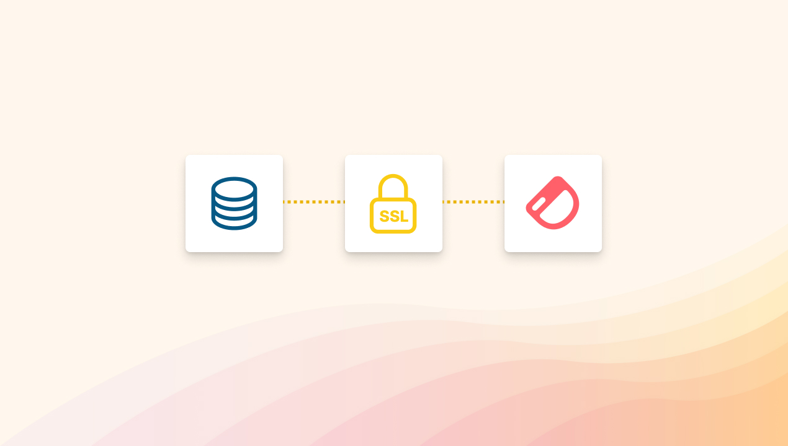

## Additional database security with SSL

When you connect your database to an app, a figurative bridge is created to pass data back and forth. Sometimes, attackers might intercept your data via the bridge.

**To help you more securely connect your database to Dashibase, we now support Secure Socket Layer (SSL) connections!**

SSL connections provide an additional layer of security by encrypting the data that moves between your database and Dashibase. It prevents attackers from accessing your data during transmission (i.e. snooping) and ensures the database is connected to the app, not an attacker in the middle (i.e. man-in-the-middle attacks).

To set up an SSL connection, simply upload your SSL certificate when connecting your database to Dashibase. You can download your SSL certificate from your database provider. For Supabase users, you can find it under Settings > Database > SSL Connection.

## Use restricted users for more data access control

If you don't want to expose your entire database to Dashibase, you can [create a restricted user in Postgres](https://aws.amazon.com/blogs/database/managing-postgresql-users-and-roles/) (i.e. a user that can only access part of your database) and use that user to connect to Dashibase.

Previously, you can only connect your database to Dashibase using your admin credentials. We now support connecting using restricted Postgres users so that you can control what tables and columns you want to share with Dashibase. 

Shoutout to [Rishabh](https://twitter.com/rishdotblog) for bringing this up!

P.S. If you are using a database provider (e.g. AWS, Azure, or Google Cloud) that blocks incoming connections by default, which is good for security, you can whitelist our static IP address (52.201.72.191/32) to connect your database to Dashibase.

## Improvements and fixes

- Added a note on the data connection page that we do not download or store any data from users' databases. (It would be quite a nightmare to deal with that server cost!)
- Added support for older versions of Postgres databases. This was causing an error for some users. (Thanks, [Fabian Morón Zirfas](https://github.com/ff6347) and Emmanuel, for reporting this issue.)
- Support connecting databases with non-admin credentials (Thanks, [Rishabh](https://twitter.com/rishdotblog), for bringing this up.)
- Simplified data source connection step by removing unnecessary steps for free users
- Improved the copy in the demo dashboard so that new users understand how to use Dashibase (Thanks again, [Orlie](https://twitter.com/sunglassesface), for the feedback on our onboarding experience.)
- When users create a new dashboard, we now include some explanations and add the table with the most joins to help them understand our table feature better
- Filter and sort options are now sorted according to what columns are shown and hidden from the table so that users can more quickly pick the shown columns for filtering or sorting
- Limit pagination to 10 rows per page so that large tables can be displayed properly in dashboards (Thanks, [Allan Whatmough](https://www.linkedin.com/in/allanwhatmough/), for working through this issue with us.)
- Added validation for date fields (Thanks, [Fernando Pintado](https://www.linkedin.com/in/fernandopintado/), for reporting this and testing our fix.)
- Show "No available options" when a dropdown has no options available, to prevent any confusion
- Limit table rows to a reasonable max-height so that large cells (e.g. JSON) do not cause the table to be extremely long and slow down the page
- Fixed a bug where the join tables could not be added to the single-item view
- Fixed a bug that deleted a table when a user was trying to convert the table but hit Cancel
- Fixed a bug where the filter condition "contains" was not case-sensitive
- Fixed a bug where a table could not be sorted by a joined column that was hidden from the table
- Fixed a bug that broke a page if it has "/" in the page name
- Fixed a bug where pressing Enter repeatedly on an empty page title added "Untitled" text blocks
- Fixed a bug that prevented users from creating a dashboard if they had table names starting with an underscore
