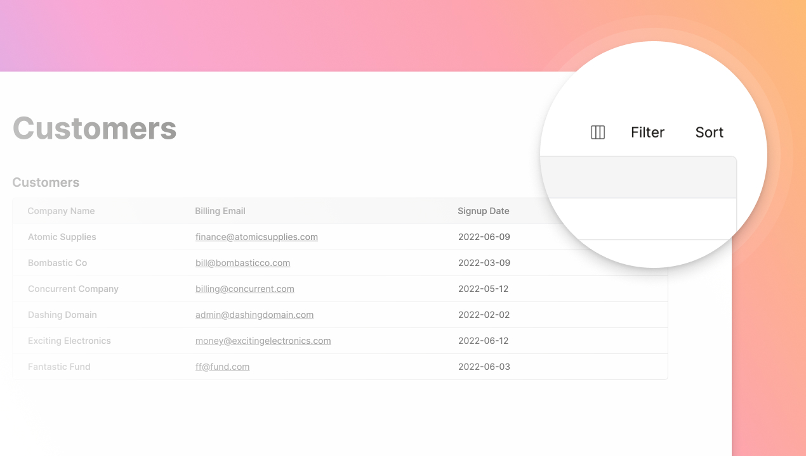

There aren't as many product updates this past week because a few of us were out (for military training and exams) and we also devoted some time to reflecting on our company's progress so far. Are we building the right solutions for our users? How are users using our product? What are we missing?

Since we [opened up our beta to the public](https://dashibase.com/changelog#2022-09-19-dashibase-now-available-in-open-beta) two weeks ago, we now have some quantitative product usage data to complement the qualitative feedback from users. (On this note, we are very keen to speak to Dashibase users and any developer who wants to build internal tools much more quickly. Feel free to drop me an email at alfred@dashibase.com.)

While we don't have any new features to share, I want to highlight a feature that we have not talked about much: 

## Selecting data via a GUI (without writing SQL!)

One of the most consistent feedback we heard from the people we have spoken to is: They do not want to write SQL. Either they don't know how to write SQL or they find writing SQL such a pain.

So we came up with a different approach to selecting data—without writing SQL: 

1. Type '/table' to add a table to your dashboard
2. Select the table you want from your database
3. Hide the columns of the table that you don't want and show the joined columns that you want
4. Filter the data by any of the columns
5. Sort the data by any of the columns

You get to see exactly what data you are selecting as you are going through these steps:

In the Preview and Use Dashboard modes, you will only see the data you have selected. You can add more filters and sorts or hide the existing columns but you will not be able to see the columns that were hidden or the data that was filtered out. 

As a bonus, every item in the table has an automatically-generated single-item view, which you can customize in the Edit Dashboard mode.

If you have any questions about this feature, just ask us in [our Discord](https://discord.gg/crhDFYvbbq) or email me at alfred@dashibase.com.

## Improvements and fixes

- Where appropriate, hitting "Enter" now executes the call-to-action (e.g. connect, rename, etc.) to minimize the number of clicks for users
- Fixed a bug that caused members in organizations on the free plan to not get access to all dashboards (Thanks, [Sonja Leaf](https://www.linkedin.com/in/aleaf/), for reporting this.)
- Fixed a bug that caused the browser to become unresponsive when creating a dashboard with a large database (>100 tables) (Thanks, Dave Cook, for reporting this.)
- Fixed a bug that caused filters and sorts to be applied to and removed from tables across pages with the same number of blocks
- Fixed a bug that caused navigation in the filter input via the arrow keys to not work so that users can move across characters without using a mouse
