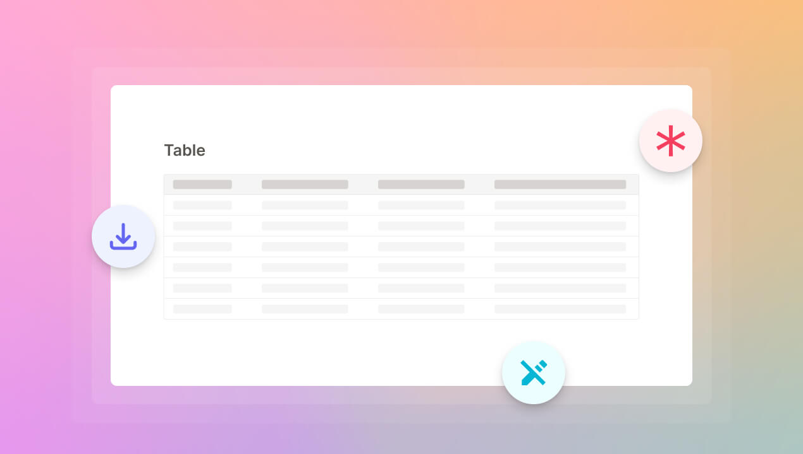

## Do more with the Table block

When we first built the Table block, it was a super easy way for you to find and update data in your database, without even writing SQL. But we always wanted it to do more. We just upgraded the Table block so that you can do more things:

- **Export as CSV:** You can now export your table as a CSV file. With our Notion-like interface, you and your team can select, filter, and sort your data before you download it—all without writing SQL. This is great for teams who want to work with their database data in a spreadsheet (e.g. do calculations or create charts).
- **Set fields as required or read-only:** For the items on your table, you can now set the fields as required or read-only. For example, you might want to set the "Customer Name" field as required and the "Customer ID" field, which is automatically generated by your backend, as read-only. This ensures that your data remains clean. 

There are more improvements (e.g. dropdown, search box, etc.) coming soon. Keep an eye out for them!

## Want to add your custom code?

Many developers have told us they want to be able to add their own code and not be limited by Dashibase. Maybe 80% can be done with Dashibase and 20% with their own code. 

So we just started a project for that and would love to work closely with developers to answer some big questions and build out the feature. 

- What exactly do developers want to do? Trigger custom business logics? Transform data? Create custom components? Or something else?
- How would they want to write and add their code? Inside Dashibase? Via their IDE?
- What data or information would they need from their Dashibase account? How do they want to access them? Via an API? Via webhooks?

If you are using Dashibase or considering using Dashibase and want to add your own code, we would love your help to shape this feature. You can reach us, the founders, at sk@dashibase. Thanks!

## Improvements and fixes

- Fixed a bug where adding filter or sort in the Preview mode shows hidden columns
- Fixed an issue where a user couldn't connect a database and create dashboards (Thanks, [Dan Syrstad](https://www.linkedin.com/in/dsyrstad/), for working with us on this.)
- Added a feedback form for users who are keen to add custom code