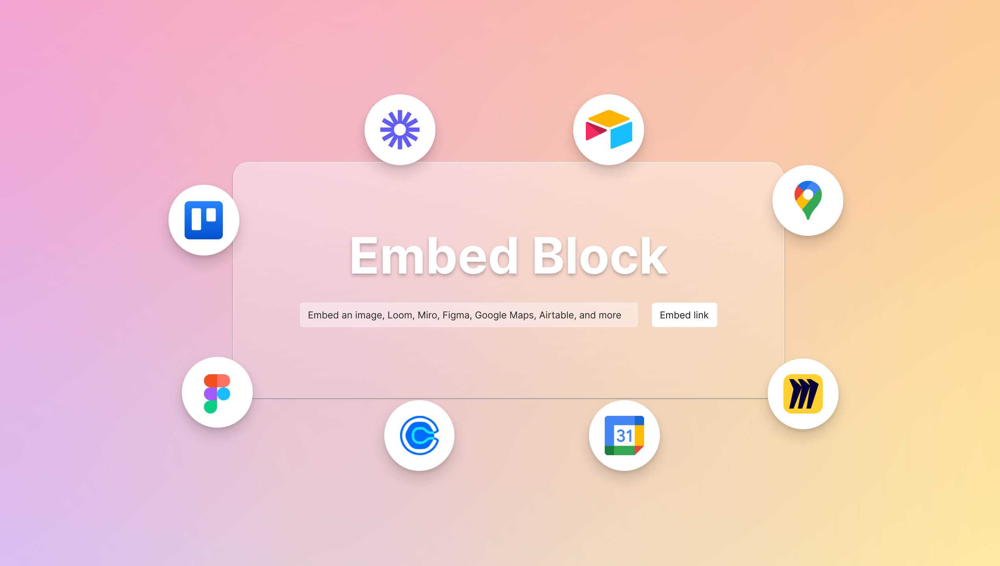
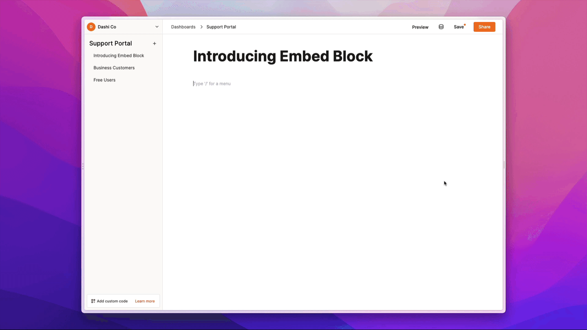

## Extend your dashboards with the new Embed block

We just added a new block that allows you to add a whole bunch of tools and content to your Dashibase dashboards. Anything that can fit inside an iframe can be embed in Dashibase. 

**Just type '/embed' and enter the URL you want to embed.**

We automatically convert popular apps' URL to an embed so that you do not have to search for the embeddable link yourself. (Looking at you, YouTube.) You can then adjust the embed's height and width. 

If you are not sure what to do with the new Embed block, we shared [six ideas on our blog](https://dev-451.dashibase.com/blog/embed-block/)— video instructions, calendars, diagrams, and more.

## A smoother column experience

Before this update, the columns menu of a table, along with the other table buttons, would jump around abruptly when you show or hide columns. That is because the table buttons were fixed to the top-right of the table and would "jump" when columns were added or removed. It made showing or hiding columns slightly annoying because you had to move your mouse horizontally back to the columns menu to select another column.

Now, the columns menu and other table buttons will only reposition themselves when you hide the columns menu by clicking outside of the menu or clicking on the columns button again. All the table buttons will gracefully glide to the new position. 

## Improvements and fixes

- Added the required and read-only options to the File Upload input block. 
- Fixed a bug where the cross icon for deleting uploaded files would turn red even when the mouse is hovering over the block and not the icon itself
- Added a note to the data source connection page that all credentials are encrypted, and included a guide for users who want to [connect their database via a restricted PostgreSQL user to limit data access by Dashibase](https://dashibase.com/blog/restricted-postgresql-user/)
- Removed focus outline for text blocks on Safari
- Set up additional tests for the Dashboards page so that new product improvements are less likely to break existing features.
- Fixed an uncaught error when 'Set user access' is clicked in the Dashboards page. It didn't affect the functionality of the app but made our tests fail. 
