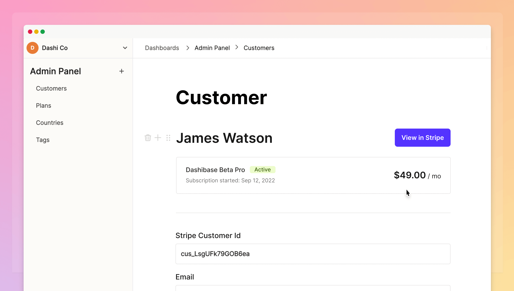

## Introducing Plugin block: Bring your own code

Some developers have been hesitant to use Dashibase because they were not able to add their code. While they might not necessarily _need_ to add their code now, they want to know they _can_ if they want to.

The good news is: **You can now add your code to Dashibase to power up your dashboards!**

The way to do it is via [our new Plugin block](https://dashibase.com/blog/plugin-block/). Essentially, Dashibase can pass whatever data you want from your database to your plugin app. Then, you can do whatever you want with the data in your plugin app. Here are a few examples:

- Display Stripe subscription information
- Enrich customer data with Clearbit
- Send emails via SendGrid
- Generate invoices
- Refund transactions with a click
- Generate images and articles with AI

Learn more about the new Plugin block via [our launch blog post](https://dashibase.com/blog/plugin-block/) or get started via [our documentation and guides](https://dashibase.com/docs/). 

## Improvements and fixes

- Fixed a bug that caused an incorrect validation error when trying to save an item on newly added tables
- Fixed a bug that created additional characters if a heading block ended with ' ', '&', '>', or '<'.
- Fixed a bug that caused the app to be stuck on the loading screen after signing up