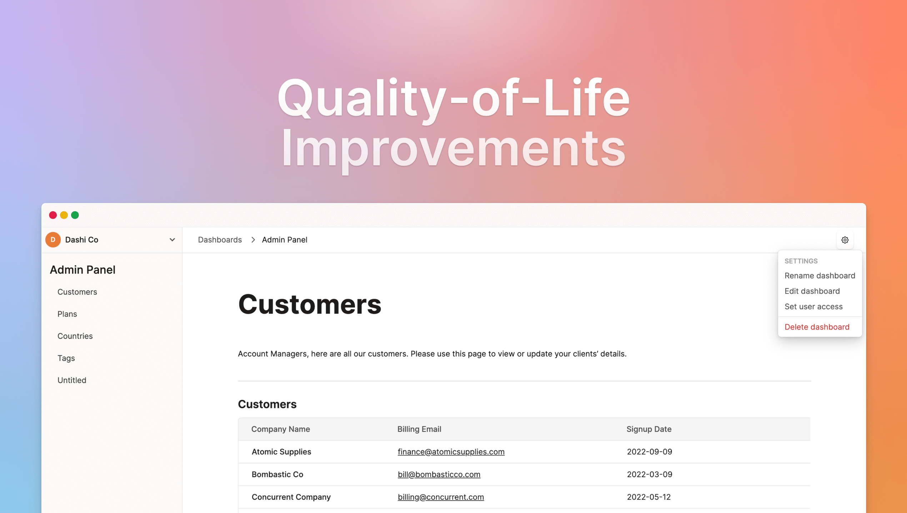

After [the launch of our Plugin block](https://dashibase.com/blog/plugin-block/) last week, we decided to tackle a few smaller but important projects. We call them quality-of-life (QOL) improvements. 

QOL improvements are things that make your experience using Dashibase better. While new features add new value to the product, QOL improvements make the existing features work even better. For example, it could be making things load faster, simplifying workflows, or even making the experience delightful. 

The Minimum Viable Product (MVP) mentality often creates software that works but horrible to use. That is sometimes necessary for moving fast and validating ideas. But it is also important to clear the UX debt. Great companies go beyond that and turn negative experiences into delightful ones. We strive to be one.

## Dashboards now default to "Use" mode

When you open a dashboard now, you will be in the "Use" mode. If you want to edit the dashboard, click on the Settings icon in the top-right corner and select "Edit dashboard".

90% or even 95% of the time, you would be using your dashboard. Not editing it. It felt counter-intuitive to open dashboards in the "Edit" mode and require you to click on "Preview" to use the dashboard. Also, opening dashboards in the "Use" mode prevents accidental changes to the dashboards, which was a common issue previously.

## Tables now load much faster

If your database is based outside of the US, your tables will load much faster now. For my database in Southeast Asia, the time decreased from about 5 seconds to just 1 second!

We deployed additional Lambda functions around the world after we realized our US-based Lambda function created terrible latency for databases in other parts of the world. If you are still having latency issues, [let us know](https://twitter.com/dashibase). 

## Every item now has a unique URL

When you view an item on a table, the detailed item page now has a unique URL. You can link to specific items on your table, share a particular item with your teammates, and more.

## Opening Dashibase now resumes last visited page

If you close Dashibase and open it again, you will now return to your last visited page. Also, because each detailed item page now has a unique URL, if you close Dashibase while viewing an item, opening Dashibase returns you to the item.

Previously, we would always redirect you to your Dashboards page, which can be annoying because you need a few clicks to get back to where you were. No more!

## Connecting a database creates a new dashboard automatically

When you connect a new database, we would automatically create a new dashboard for you. All you have to do is to name the dashboard.

Previously, you had to navigate to the Dashboards page, click "Create dashboard", name the dashboard, and select the newly connected database. We simplified the four steps into one.

## Improvements and fixes

- Your dashboards on the Dashboards page is now ordered by the updated time. The most updated dashboard will be first.
- We added a Settings menu in the upper-right corner of the dashboards, where you can find the option to rename the dashboard, edit the dashboard, change user access, or delete the dashboard.
- Since we changed a few aspects of the user experience, we update the onboarding guide in the Get Started Here demo dashboards that new users get when they sign up for Dashibase.
- We renamed Short Answer and Long Answer blocks to Short Text and Long Text, which is more accurate. (What were we even thinking previously!)