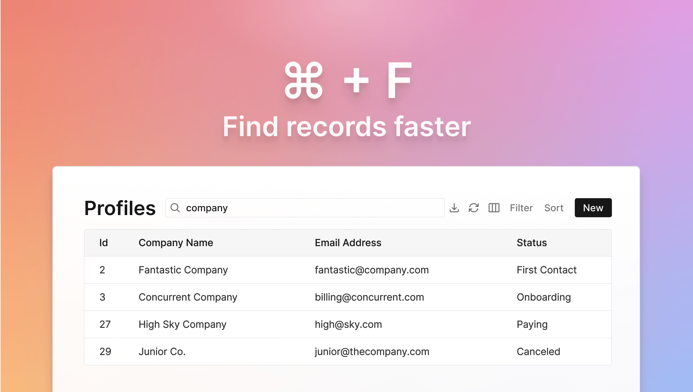

## Finding a record is much faster now

You search for your customers in your admin panel multiple times a day to view their account, update their information, or support them. Previously, you had to use filters to search. That takes several clicks and is slow.

Now, you can search faster than I can finish this sentence! 

- `Cmd/Ctrl` + `F` to open the search box
- Type your search term
- `Enter` to search
- `Esc` to clear the search

Given that you search so many times a day, all these time-savings add up. 

## Support for enum data type

You can now filter, sort, and update [Enumerated (enum) data](https://www.postgresql.org/docs/current/datatype-enum.html) in Dashibase.

For example, you might have a customer status field with the following options:

- First Contact
- Onboarding
- Paying
- Canceled

Or a priority field with the following options:

- P0
- P1
- P2
- P3

Dashibase will automatically create a single-select dropdown for this field in the record view and populate it the respective options. You can also filter your table by any of the options.

(If you need help with creating an enum column in your database, [this Stack Overflow answer](https://stackoverflow.com/questions/72842588/is-there-a-way-to-define-a-postgresql-column-as-an-enum) might help.)

## Improvements and fixes

- Added support for [generated columns](https://www.postgresql.org/docs/current/ddl-generated-columns.html). (Generated columns are excluded from all INSERT/UPDATE requests since they are automatically computed from other columns.)
- Improved styling of text blocks (reduced text block's vertical padding, increased H2 and H3 font weight, and reduced H3 font size)
- Added logging of error messages when queries fail so that we can fix them and reduce the error rate
- Added tracking for the time it takes to fetch and update database data so that we can improve it even more