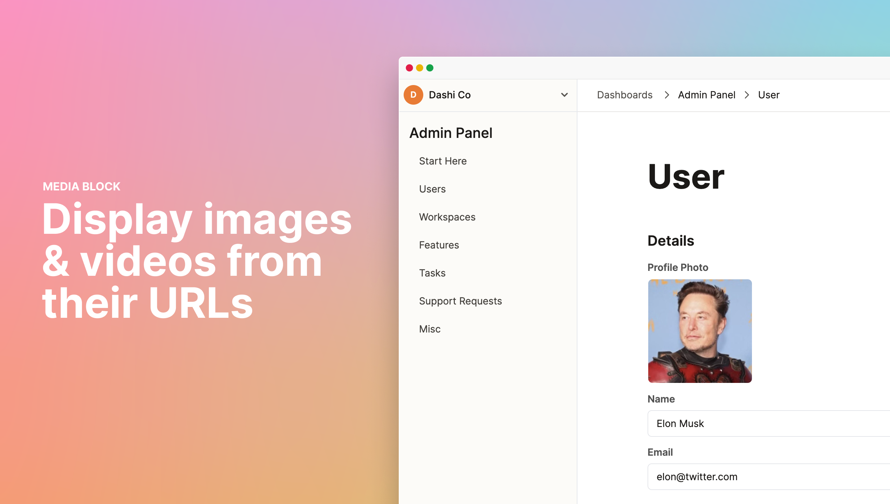

## Display images and videos from their URLs

If you store image or video URLs, including YouTube, Vimeo, and Loom videos, you can now display the image or video in the record view using the new Media block.

We try to detect fields that are image or video URLs and automatically set them to the Media block. You can also manually convert a field to the Media block by click on the block menu (⠿) on the left of the block.

Once you have set the Media block, you can resize it by dragging the block frame on the right and bottom of the block. When you hover over the block, you will see the field to change the URL.

Note that changing the URL renders the new image or video but doesn't update the field in your database. You would need to click "Save" on the record view to update your database.

## Improvements and fixes

- Added support for composite primary keys (i.e. primary keys that are made up of a combination of values in the columns)
- Fixed a bug that broke the table when a foreign table's enum column is selected for filtering
- Fixed a bug where changes to the table column width was not reflected until I refresh the page.
- Fixed an old bug that reoccurred. Filters and sorts were applied and removed across pages, instead of the specific table they were applied to.
- Fixed a bug where dashboards newly shared with organization members were not visible unless they log out and log in.
- Fixed a bug where organization members with "Edit dashboard" access couldn't see the Settings button to edit the dashboard.